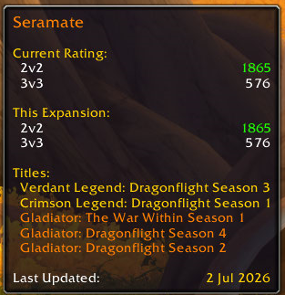
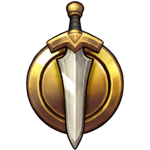
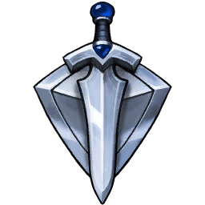
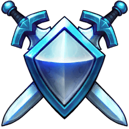
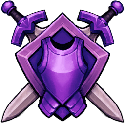
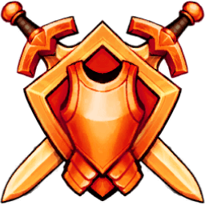
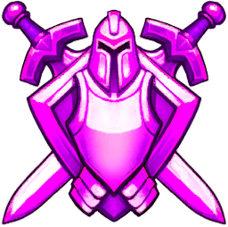
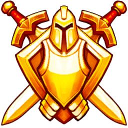
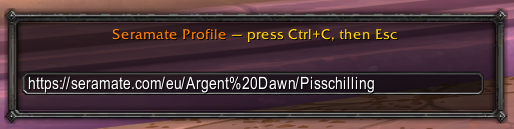
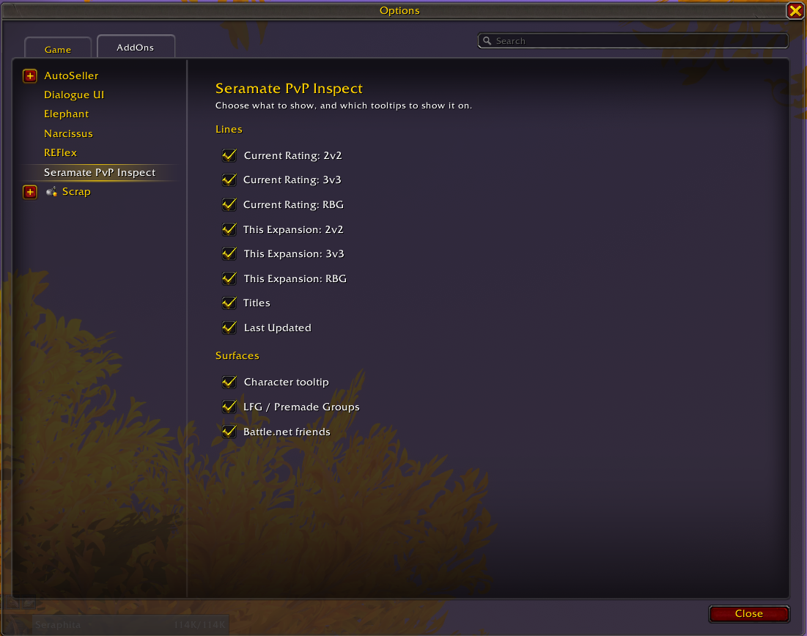

<h1>Seramate PvP Inspect</h1>

<em>See any player's PvP ratings and notable titles, right on their in-game tooltip.</em>

  
  
  
  
  

## What it does

Hover any player and Seramate PvP Inspect adds their arena and battleground standing to the tooltip. The data comes from Seramate's own PvP ladder database and is bundled into the addon, so lookups are instant and work fully offline while you play.

<table>
<tr><td><b>Current rating</b></td><td>2v2, 3v3, Rated Battlegrounds, and Solo Shuffle</td></tr>
<tr><td><b>This-expansion peak</b></td><td>the highest rating hit in each bracket</td></tr>
<tr><td><b>Notable titles</b></td><td>the character's top titles, colored by prestige tier</td></tr>
<tr><td><b>Tier-colored ratings</b></td><td>green, blue, purple, and orange, so skill reads at a glance</td></tr>
<tr><td><b>Last Updated</b></td><td>a freshness date on every tooltip</td></tr>
<tr><td><b>Profile copy-link</b></td><td>right-click a player to copy their seramate.com profile</td></tr>
</table>

Titles are colored by prestige tier, low to high:

  
  
  
  
  
  
  
  

## Where it shows

Seramate PvP Inspect hooks every surface where other players appear. Each one is shown below.

### Character tooltips

Player unit frames, portraits, and nameplates — hover anyone to see their ratings and titles.

<!-- screenshot: save as .github/assets/surfaces/tooltip.png, then uncomment -->
<!-- 

 -->

### LFG / Premade Groups

Group leaders in the Premade Groups results, and applicants to your own group.

<!-- screenshot: save as .github/assets/surfaces/lfg.png, then uncomment -->
<!-- 

 -->

### Battle.net friends

Online friends currently playing WoW, on the friends-list tooltip.

## Copy Seramate Profile

Want to look someone up on seramate.com? Right-click them and hit **Copy Profile Link** — their profile URL is ready to paste.

## Install

The download contains three folders. Drop all three into `World of Warcraft/_retail_/Interface/AddOns/`:

- **Seramate**: the addon itself (UI and logic), always loaded.
- **Seramate_DB_EU** and **Seramate_DB_US**: the bundled rating databases, one per region, loaded on demand so only your region is held in memory.

Reload or restart WoW after copying.

## Settings and commands

Type **`/seramate`** (or the shorter **`/sera`** or **`/sm`**) to open settings.

  

Two sets of toggles, all on by default:

- **Lines**: which rows appear. Current 2v2 / 3v3 / RBG / Shuffle, this-expansion 2v2 / 3v3 / RBG / Shuffle, Titles, and Last Updated.
- **Surfaces**: which tooltips the addon hooks. Character tooltip, LFG / Premade Groups, and Battle.net friends.

`/seramate dbg` (or `/seramate debug`) toggles debug messages on and off.

## Coverage and data

- **EU and US** characters who reached at least **1500** rating in any bracket this season (**1800** for Solo Shuffle).
- Data is bundled into the addon, so lookups are local with no network calls.
- Refreshed by new releases, published daily when the ladder changes.

## How it works

Seramate ingests the entire WoW PvP ladder. A backend command packs each region's ratings and titles into Lua files and publishes them; a GitHub Actions workflow fetches the latest data and cuts a release. In-game, the addon resolves the hovered character by `Name-Realm` and renders their ratings and titles into the tooltip.

## Development

Pure-Lua modules under `Core/`, `Surfaces/`, `Settings/`, with the generated realm map in `Data/realms.lua`. The bundled `*_HORDE.lua` / `*_ALLIANCE.lua` data files are not in git; the release workflow fetches them from R2 at build time.

- Lint: `luacheck .`
- Tests: `lua5.1 tests/run.lua` (pure-logic tests with a mocked WoW API).
- Release: `.github/workflows/release.yml` (fetch data from R2, then the BigWigs packager to a GitHub Release), triggered by a data refresh, a manual run, or the daily cron.

## Support Seramate

If you'd like to help keep Seramate growing — and pick up a few perks along the way — check out our [Patreon page](https://seramate.com/patreon).

  

Data from <a href="https://seramate.com">seramate.com</a>. Artwork &copy; Seramate.

